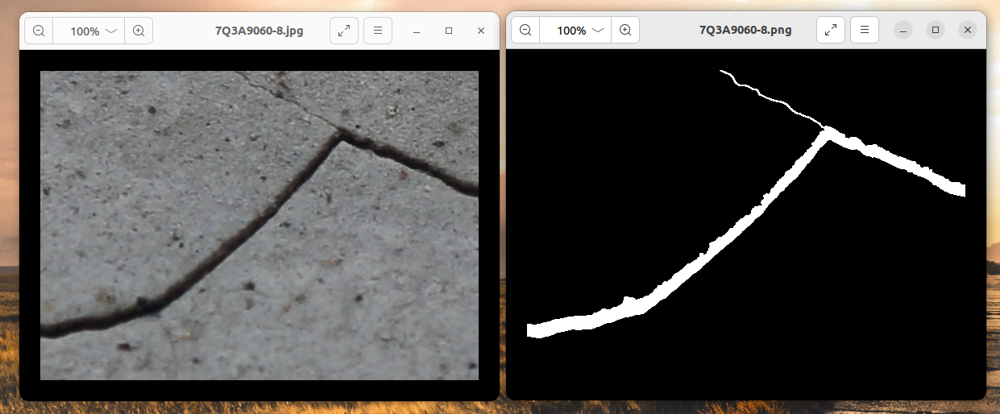
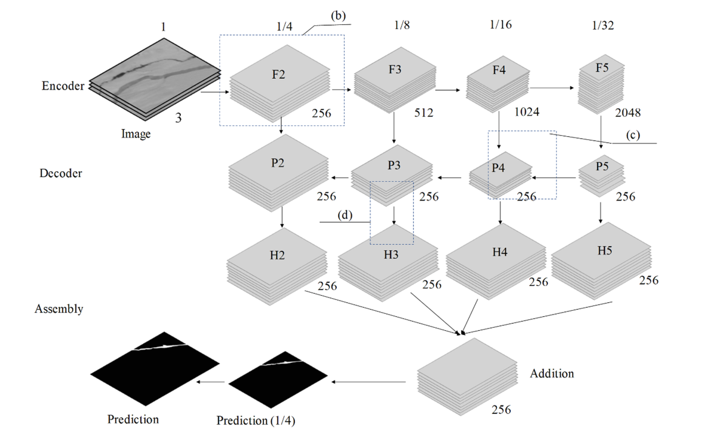
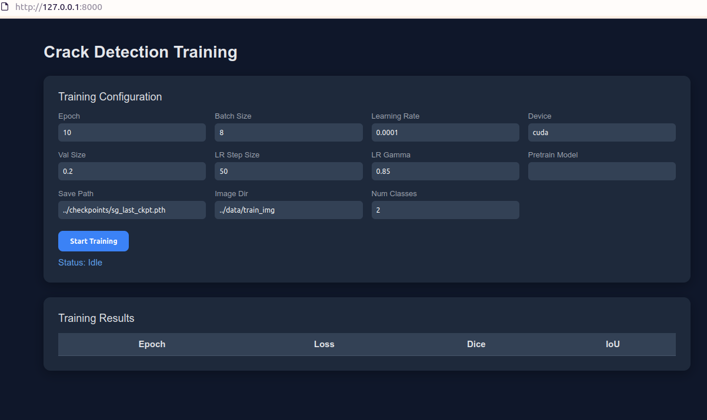
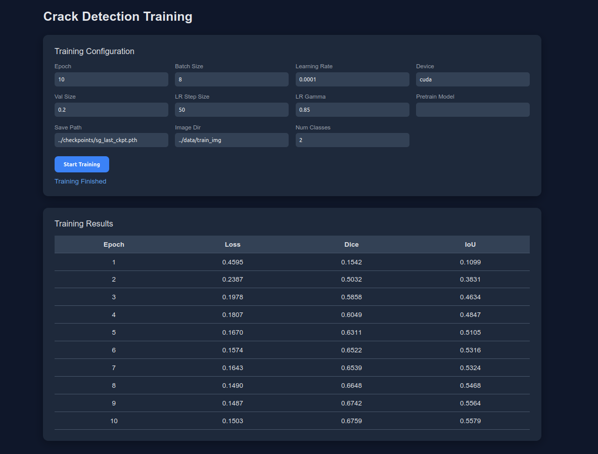

### 混凝土结构裂缝：语义分割

------

`项目链接：`

#### 一、数据集



原图为`RGB图像`，标注图只有背景`(0)`和裂缝前景`(255)`


#### 二、模型结构



Crack-FPN整体实现逻辑是：

```plain
输入图像 (3, 320, 320)
    ↓
[Encoder: SE-ResNeXt50]  ← 提取多尺度特征
    ↓
F2(256,80,80) → F3(512,40,40) → F4(1024,20,20) → F5(2048,10,10)
    ↓
[Decoder: FPN]  ← 特征金字塔融合
    ↓
P2(256,80,80) → P3(256,40,40) → P4(256,20,20) → P5(256,10,10)
    ↓
[Assembly Module]  ← 多尺度特征组装
    ↓
融合特征 (256, 80, 80) → 上采样 → (256, 320, 320)
    ↓损失函数：
[Output Conv] 1×1卷积
    ↓
输出 (1, 320, 320)  ← 裂缝概率图
```

模型代码实现在项目`crack/model.py`文件


#### 三、损失函数、优化器、训练超参

**损失函数：**

单独使用 BCE Loss 的问题：裂缝像素通常 < 1%，背景占99%，背景像素贡献大部分loss，模型倾向于全部预测为背景

BCE + Dice Loss 优势：

| **BCE**  | 训练初期 | 提供稳定梯度，快速收敛到大致区域 |
| -------- | -------- | -------------------------------- |
| **Dice** | 训练后期 | 精确优化边界，处理类别不平衡     |

损失函数实现在项目`crack/loss.py`文件


**优化器&学习率调度器：**

本例采用`optim.Adam`、`optim.lr_scheduler.StepLR`


**训练超参数：**

```json
# 训练
Train:
  epoch: 1000 # 训练轮数
  batch_size: 8 
  learning_rate: 1e-4 # 初始学习率
  device: "cuda" # 训练设备
  val_size: 0.2 # 验证集比例
  lr_step_size: 50 # 学习率衰减步长
  lr_gamma: 0.85 # 衰减因子
```

以上具体实现在项目`crack/train.py`中


#### 四、训练loss、dice、iou

训练日志数据在项目`log/train.log`


#### 五、FastAPI 服务搭建

提供HTTP接口实现模型训练，流程如下：

1. 运行 script/run.py，服务器启动

```
/home/hhwy/simon/sg/.venv/bin/python /home/hhwy/simon/sg/script/run.py 
INFO:     Started server process [84681]
INFO:     Waiting for application startup.
INFO:     Application startup complete.
INFO:     Uvicorn running on http://0.0.0.0:8000 (Press CTRL+C to quit)
```

2. 访问 http://0.0.0.0:8000，展示训练界面



3. 配置参数并点击`Start Training`




#### 六、Docker部署

打包环境：Ubuntu 22.04

dockerfile和运行脚本在`docker目录`下


